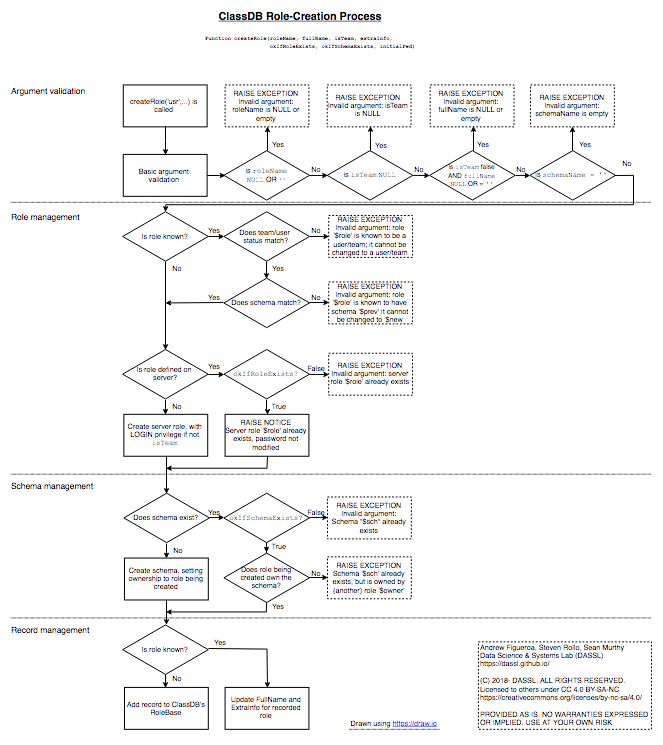

[ClassDB Home](Home) \| [Table of Contents](Table-of-Contents)

---
# Adding Users

_Authors: Andrew Figueroa, Sean Murthy_

ClassDB provides three functions to add users to an instance of ClassDB; one for each [group role ClassDB defines](Roles). The functions are located in the `classdb` schema and can be executed by instructors and DB managers. All three functions have an identical set of parameters.

Successful execution of each user-creation function ensures that the user being created:

- Exists on the server in which ClassDB is installed
- Has appropriate privileges for their group role
- Has a schema that they own assigned to them
- Is recorded internally by ClassDB.

Depending on the function arguments given, and state of the server and database that an instance of ClassDB is running on, this may involve ClassDB creating a server role and database schema for the new user.

Regardless of the group role(s) they are a part of, every user name must be unique among all users/roles on the server, even among users/roles not created through ClassDB. By default, role names are not case sensitive internally, and are folded down to lowercase. A user name may be enclosed in double quotes to preserver case. See [Postgres documentation](https://www.postgresql.org/docs/9.6/static/sql-syntax-lexical.html#SQL-SYNTAX-IDENTIFIERS) for details on user names and other PostgreSQL identifiers. In either case, clients will require the case to match what is stored internally.

If the user being created does not exist on the server, then ClassDB will create a server role and set a password for the user. An initial password may be optionally supplied. If an initial password is not supplied, the user's password is set to the same value as the user name. Whether an explicit initial password is provided or a default initial password is used, every user should [change their password](Changing-Passwords) soon after first log in.

To remove users that were added to ClassDB, see [Removing Users](Removing-Users). Otherwise, to only revoke the ClassDB group roles that have been assigned to them, see [Revoking Roles](Revoking-Roles).

## Functions

The following are partial definitions of the three functions used to create users. Data types of parameters have been modified from their internal referential representation to their effective types.

```
ClassDB.createStudent(userName VARCHAR(63),
                      fullName VARCHAR,
                      schemaName VARCHAR(63) DEFAULT NULL,
                      extraInfo VARCHAR DEFAULT NULL,
                      okIfRoleExists BOOLEAN DEFAULT TRUE,
                      okIfSchemaExists BOOLEAN DEFAULT TRUE,
                      initialPwd VARCHAR(128) DEFAULT NULL)

ClassDB.createInstructor(userName VARCHAR(63),
                         fullName VARCHAR,
                         schemaName VARCHAR(63) DEFAULT NULL,
                         extraInfo VARCHAR DEFAULT NULL,
                         okIfRoleExists BOOLEAN DEFAULT TRUE,
                         okIfSchemaExists BOOLEAN DEFAULT TRUE,
                         initialPwd VARCHAR(128) DEFAULT NULL)

ClassDB.createDBManager(userName VARCHAR(63),
                        fullName VARCHAR,
                        schemaName VARCHAR(63) DEFAULT NULL,
                        extraInfo VARCHAR DEFAULT NULL,
                        okIfRoleExists BOOLEAN DEFAULT TRUE,
                        okIfSchemaExists BOOLEAN DEFAULT TRUE,
                        initialPwd VARCHAR(128) DEFAULT NULL)
```

## Parameters

| Parameter Name and Effective Data Type | Default Value                 | Notes                                                                                                                                                                                                                                                                                                                                                                                                                                                                                                                                                                                                                                                                                                                 |
|----------------------------------------|-------------------------------|-----------------------------------------------------------------------------------------------------------------------------------------------------------------------------------------------------------------------------------------------------------------------------------------------------------------------------------------------------------------------------------------------------------------------------------------------------------------------------------------------------------------------------------------------------------------------------------------------------------------------------------------------------------------------------------------------------------------------|
| `userName`: `VARCHAR(63)`             | None - **required parameter** | The username that the user will use to connect to the server instance. This value should follow the rules for SQL Identifiers in Postgres.<br/><br/>If a no server role matches `userName`, then a server role is created with this name.<br/><br/>If a server role matching `userName` does exists on the server, then if `okIfRoleExists` is false, an EXCEPTION is raised. Otherwise, if `okIfRoleExists` is true, the function will raise a NOTICE, but continue creating the user.<br/><br/>Regardless of the value of `okIfRoleExists`, if the role already exists on the server, the password for the role is not changed.                                                                                     |
| `fullName`: `VARCHAR`                 | None - **required parameter** | The user's given name, or some other identifying information that should be stored for later reference.                                                                                                                                                                                                                                                                                                                                                                                                                                                                                                                                                                                                               |
| `schemaName`: `VARCHAR(63)`           | `NULL`                        | The name of the schema that should be assigned to the user being created. This value should follow the rules for SQL Identifiers in Postgres. If `NULL`, the default value, then `userName` is used as the schema name.<br/><br/>If a schema matching `schemaName` does not exists in the database ClassDB is installed in, it is created and ownership of the schema is assigned to the role matching `userName`.<br/><br/>If a schema matching `schemaName` does exist in the database, then if `okIfSchemaExists` is false, an EXCEPTION is raised. Otherwise, if `okifSchemaExists` is true, then it is verified that the user being created has ownership of that schema. If they do not, an EXCEPTION is raised. |
| `extraInfo`: `VARCHAR`                | `NULL`                        | Any additional information that is desired to be stored.                                                                                                                                                                                                                                                                                                                                                                                                                                                                                                                                                                                                                                                              |
| `okIfRoleExists`: `BOOLEAN`           | `TRUE`                        | If `TRUE`, then no EXCEPTION is raised by the function if a role matching `userName` already exists on the server.                                                                                                                                                                                                                                                                                                                                                                                                                                                                                                                                                                                                      |
| `okIfSchemaExists`: `BOOLEAN`         | `TRUE`                        | If `TRUE`, then no EXCEPTION is raised by the function if a schema matching `schemaName` already exists on the server AND the role matching `userName` is the owner of the schema.                                                                                                                                                                                                                                                                                                                                                                                                                                                                                                                                      |
| `initialPwd`: `VARCHAR(128)`          | `NULL`                        | An initial password to set for the role. If `NULL`, the default value, then the folded value of `userName` is used as the initial password. This value is only used if a server role is created by ClassDB, so if the role already existed on the server, then the password for the role is not modified.                                                                                                                                                                                                                                                                                                                                                                                                               |

## Examples

To create an instructor with a username of "caldwellj" and a given name of "Jessica Caldwell", the following query can be run:

```sql
SELECT ClassDB.createInstructor('caldwellj', 'Jessica Caldwell');
```

Assuming that the server-level role and database schema did not exist prior to running the query, the following will be true after executing:

- A server-level role 'caldwellj' was [created with LOGIN privileges](https://www.postgresql.org/docs/9.6/static/sql-createrole.html) and a password of 'caldwellj'
- The role was granted the [`classdb_instructor` privilege](Roles)
- A [schema](https://www.postgresql.org/docs/9.6/static/ddl-schemas.html) named 'caldwellj' was created in the database, and the recently created role 'caldwellj' was assigned ownership of this schema
- The instructor is recorded within ClassDB, and will now show up [in corresponding views](https://github.com/DASSL/ClassDB/wiki/Viewing-Registered-Users)

If we wanted to be sure that the server-level role and database schema did not exist prior to creating the user, the following query can be run instead:

```sql
SELECT ClassDB.createInstructor('caldwellj', 'Jessica Caldwell', NULL, NULL, FALSE, FALSE);
```

If the server role `caldwellj` or the database schema `caldwellj` already existed, then running the query would raise an EXCEPTION.

To create a student named "Emmett Bell" with a username of "bell001", while storing their email address in extra info, the following query can be run:

```sql
SELECT ClassDB.createStudent('bell001', 'Emmett Bell', NULL, 'bell001@example.edu');
```
To also assign them a default password of "changeMe" (all passwords are case-sensitive) while still allowing the server role and schema to exist prior, use:

```sql
SELECT ClassDB.createStudent('bell001', 'Emmett Bell', NULL, 'bell001@example.edu', TRUE, TRUE, 'changeMe');
```

In the examples shown above, the userName parameter did not preserve case, so running:

```sql
SELECT ClassDB.createInstructor('CaldwellJ', 'Jessica Caldwell');
```

Would have still created a server role and database schema named `caldwellj`. This is due to folding that occurs with SQL identifiers. To preserve case, double quotes should be used inside of the outer single quotes:

```sql
SELECT ClassDB.createInstructor('"CladwellJ"', 'Jessica Caldwell');
```

This would create a server role and database schema named `CaldwellJ`.

Creating DB managers follows an identical pattern to creating instructors and students, just with the use of the `createDBManager()` function instead.

It is possible to assign multiple group roles to a user. To do so, simply run the appropriate `createStudent()`, `createInstructor()`, or `createDBManager()` functions in any order. Note that it is necessary for the `okIfRoleExists` and `okIfSchemaExists` to be `TRUE` when assigning a second (or third) role.

## Additional Info and Troubleshooting

Internally, all three functions call the `ClassDB.createRole()` function, and then perform specific tasks for the group role that the user is being placed into. This `ClassDB.createRole()` function takes in a similar set of parameters from the three functions detailed above, but also adds an `isTeam` `BOOLEAN` parameter, which is always `FALSE` when creating users. The functionality behind this extra parameter is not yet implemented in ClassDB.

Although `ClassDB.createRole()` is never directly called by end users, analyzing the checks it performs and the messages it outputs can be useful in understanding ClassDB's behavior. The analysis can also help users determine the possible cause of any errors that occur during user creation. 

The following figure shows a flowchart of checks made and actions taken during user creation. Click on the figure to view the full-size chart. Download the source [HTML document](ClassDBRoleCreationProcess.html) for viewing in [draw.io](https://draw.io).

[](ClassDBRoleCreationProcess.png)

***
