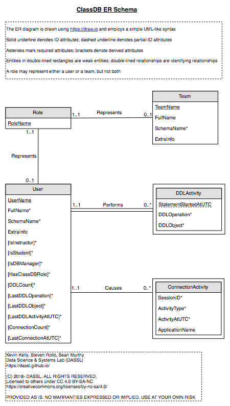

[ClassDB Home](Home) \| [Table of Contents](Table-of-Contents)

---
# Data Design

_Author: Sean Murthy_

This page provides a brief overview of the conceptual design and the [physical design](#physical-design)
of the data ClassDB maintains for (and in) each database in which the ClassDB functionality
is added.

At a high level, ClassDB maintains some basic data about all [roles](Roles) created
using its [API](Common-Tasks). It also defines some [views and functions](Frequent-User-Views)
over role data.

## Conceptual Design

The following figure shows an ER diagram with a conceptual design of role data ClassDB maintains. 
Click on the figure to view the full-size diagram. Download the source [HTML document](ER-Schema.html)
for viewing in [draw.io](https://draw.io).

## Physical Design

ClassDB maintains all its data, views, functions, and other objects in a schema named `ClassDB`.
Within that schema, it maintains role data in a single table named `RoleBase` and defines [a
view called `User`](Viewing-Registered-Users) over the `RoleBase` table.  

ClassDB does not presently support teams and thus there are no database objects corresponding
to the `Team` entity in the ER diagram. However, table `RoleBase` does contain a Boolean field
`isTeam` to distinguish between users and teams (and this field is in use). Specifically, a user
is identified by a value of `FALSE` for the `isTeam` field.

ClassDB also maintains the tables `ConnectionActivity` and `DDLActivity` respectively to [log
connections and DDL operations](Activity-Logging) by users.

***
